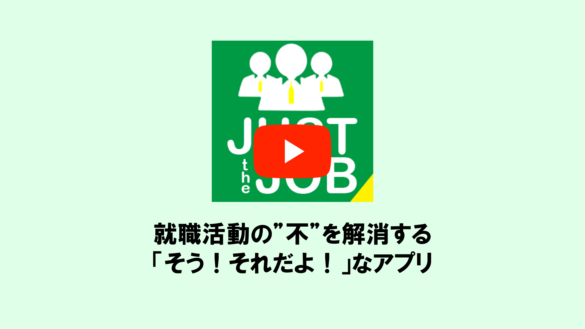

# Just The Job（そう！それだよ！！）

## 製品概要
### Job Hunting × Tech

### 背景（製品開発のきっかけ、課題等）

- 開発背景 説明動画 → 

#### 製品開発のきっかけ
- 今回のプロダクトの開発に至った背景
    - 経団連の就職ルール廃止による就職活動の変化
    - 自身の就職活動の振り返り
    - HR Techの普及（AI面接など）
#### 着目した顧客・顧客の課題・現状
##### 着目した顧客
- 就職活動を行う学生
- 採用活動を行う企業

###### 顧客の課題・現状
###### 就活生側
- 複数のマイページを管理するのが面倒
- 選考やインターンシップなどのスケジュール管理が大変
- 志望企業で実際に働く社員と出会う機会が少ない（大抵は人事部社員）
    - 出会えたとしても自身のキャリアビジョンと合わない場合がある
    - OB/OG訪問が有利に働くことは認識しているが、自身の所属大学に志望企業のOB/OGがいない
- 就職活動で東京まで行くことが困難（金銭的・時間的制約）

###### 企業側
- 学生に対して十分に企業説明ができないことによる採用機会の損失
- 内定辞退による損失
    - 2018/6/1の時点で2019卒学生の半数以上が2社以上の内定を保有
- 2019卒学生の半数以上が就職活動で「携わる仕事」を重視
> 参考URL：
> - https://saiyou-knowhow.recruit.co.jp/survey  
> - https://data.recruitcareer.co.jp/wp-content/uploads/2018/09/naitei_19s-201809.pdf

### 製品説明（具体的な製品の説明）
こちらに製品の概要・特徴について説明を記載してください。

### 特長

#### 1. 特長1

全企業のマイページを本アプリひとつで管理できる
- マイページには、DMやエントリーシートの提出フォーム、社員図鑑、Web面接、専門用語図鑑などがあり、本アプリだけで就活が完結できるように設計

#### 2. 特長2

企業の人とのやりとりはDM
- 連絡手段にメールではなく、DMを利用することで、より密接な関係性を築くことが可能
- 企業ごとにDMをやりとりする場所が違うので、メールのように重要なメールが他のメールに埋もれてしまうことがない

#### 3. 特長3

自分の性格や考え方などが似た社員とマッチングできる
- 自分に合った企業なのか確認可能
  - 『質問に答える』 or 『提出したエントリーシート』からのマッチングが可能
- 志望企業にOB/OGがいなくても、マッチングによってできた繋がりから、OB/OG訪問が可能
- 『社員図鑑』からその企業に所属する社員の一覧を閲覧可能

### 機能

- [★](#forcused_tech) 学生 and 企業の人 自動マッチング機能
  - 学生の性格特性をAIにより分析し、学生に似た性格や考え方，キャリアプランを持った人とマッチング
  - エントリーシートからの性格特性分析およびマッチング
  - マッチングした人とは、DMを通して、親睦を深めることが可能

- 企業ページの一括管理
  - 各企業ごとに用意されていた企業採用ページは、全て『Just the Job』の中

- エントリーシート提出，Webテスト，面接予約，Web面接
  - スマホアプリから利用可能
  - 就活はPCではなく、スマホでやる時代にシフト

- DM：メールでのやりとりではなく、メッセージ形式での連絡手段を用意
  - 学生はより気軽に企業の人と連絡を取ることが可能
  - 企業はより学生に近い位置で採用活動を行うことが可能

- 社員図鑑：志望企業にどういった人がいるのか調べることが可能
  - マッチング機能搭載で、気になる人がいれば気軽にコンタクトを取ることが可能

- 専門用語図鑑：志望企業特有の専門用語 一覧を調べることが可能

- コミュニティ：内定者やインターンで一緒になった学生たちと繋がることが可能
  - LINEやSlackのグループに近い機能
  
- カレンダー：就活に関する予定を一括して管理可能
  - スケジュールデータはエクスポート可能で、普段が自分が使っているカレンダーに同期することも可能

### 解決出来ること

#### 就活生側
- マイページの管理を容易化
- マッチング機能により、企業の人との新しい出会いを提供
- DMやマッチング機能を利用することで企業の人とより密接な関係を構築可能
- 企業情報に加え、普段見ることができない社員情報も見れるため、本アプリひとつで多くの情報収集が可能
  - 地方学生の金銭的負担を軽減

#### 企業側
- 連絡手段にDMを使用することで、学生とより密接な関係を構築可能
- 社員情報の公開およびマッチング機能により新たな学生との出会いを提供
- 内定を辞退された際に、その学生が本アプリを使ってどのような人と関わり・どの企業に就職したのかの情報収集が可能
    - 自社の弱みを知ることができ、次の採用に活かせる

### 今後の展望

- 実装予定
  - 質問に答えてもらうことでユーザの性格や考え方を取得し、マッチングを行う機能
  - DM機能
  - コミュニティ機能
  - マッチング機能部分のAI強化
  - 内定辞退の際、企業側へ情報提供する機能
  - Webテスト
  - 面接予約
  - 専門用語図鑑
  - カレンダー
  - iOS および Web のクライアント
  - 企業側の機能

## 開発内容・開発技術
### 活用した技術
#### API・データ

* Skyway
* AWS EC2
* AWS S3

#### フレームワーク・ライブラリ・モジュール
- android
  * Rxjava2
  * Dagger2
  * Retrofit2
  * moshi
  * Okhttp
  * Glide
  * ZXing
- backend
  * Express
  * Swagger
  * MongoDB
  * IBM Watson 

#### デバイス
* android

### 独自開発技術（Hack Dayで開発したもの）
#### 2日間に開発した独自の機能・技術
- 独自で開発したもの
  - IBM WatsonのPersonality Insightsから得られた結果をもとに、ユーザと社員のマッチングを行う機能
    - ユーザと社員の性格特性情報を比較し、同一項目におけるSAD（差の絶対値の和）が最も小さい社員とマッチング
    - 社員の性格情報と完全一致をマッチ度100%とし、SADからユーザと社員のマッチ度を算出

- 特に力を入れた部分をファイルリンク、またはcommit_id
  - ユーザと社員の性格情報からマッチングを行う機能の実装
    - commit_id : 95e339d2c6c71b09235bd72a6d377b30a10406d9
  - Watson Personality Insightsで社員の性格特性を取得する部分の実装
    - commit_id : 6ba2b59a401f1ceab00697bb70dd947504d93d5b
